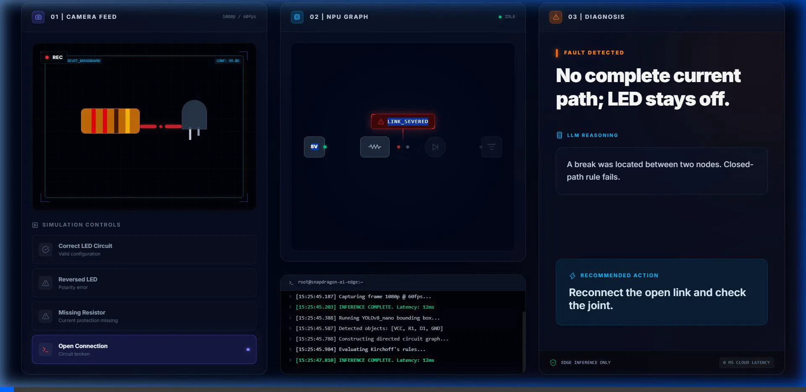

# SnapCircuit AI Prototype ⚡


**An Edge AI circuit validation prototype built for the Snapdragon AI Lab Build & Present Challenge 2026.**

This repository contains a full-stack proof-of-concept demonstrating how computer vision and rule-based AI can be leveraged on edge devices to validate hardware circuits in real-time.

## 🚀 Features



- **Real-Time Vision Simulation:** Simulates object detection bounding boxes for circuit components (VCC, GND, Resistors, LEDs).
- **Rule-Based Engine:** Validates circuit topologies using Kirchoff's laws to detect:
  - Reversed LED Polarities
  - Missing Current Protection (Missing Resistors)
  - Open Connections (Severed Paths)
- **High-Performance Dashboard:** A stunning, cyberpunk-themed React interface with live telemetry, simulated NPU utilization, and dynamic SVG data graphs.
- **Edge AI Telemetry:** Simulated terminal logs mimicking edge-device inference states and INT8 model loading.

## 🛠️ Technology Stack
- **Frontend:** React, TypeScript, TailwindCSS v4, Vite, PostCSS, Lucide Icons.
- **Backend:** Python, FastAPI, Uvicorn, Pydantic.

## ⚙️ How to Run Locally

### 1. Start the Backend (FastAPI)
```bash
cd snapcircuit-backend
python -m venv venv
# Activate the virtual environment:
# Windows: venv\Scripts\activate
# Mac/Linux: source venv/bin/activate
pip install fastapi uvicorn pydantic
python -m uvicorn main:app --reload --port 8000
```

### 2. Start the Frontend (React)
```bash
cd snapcircuit-frontend
npm install
npm run dev
```

The prototype will be running at `http://localhost:5173`.

## 🧠 Snapdragon AI Challenge Alignment
This project was designed to showcase the power of on-device AI for hardware education and debugging. By running lightweight vision models and validation rules directly on the edge, SnapCircuit provides instantaneous feedback to hardware engineers and students without relying on cloud latency.

---
*Built by Arghya De for the Snapdragon AI Lab Challenge 2026.*
